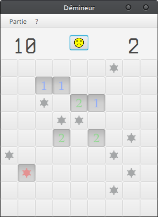

# README #

This is the result of a school project. We had to build a minesweeper clone using javaFX.

### How do I get set up? ###

* Clone this repository
* Import the project in eclipse
* Voilà.
* You also need Java version 8, and JavaFX.

### Screenshot ###

Inline-style: 

